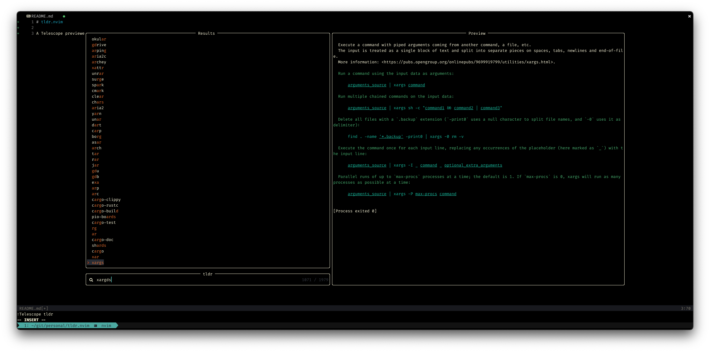

# tldr.nvim

A Telescope previewer for [tldr-pages](https://github.com/tldr-pages).

>The tldr-pages project is a collection of community-maintained help pages for command-line tools, that aims to be a simpler, more approachable complement to traditional [man pages](https://en.wikipedia.org/wiki/Man_page).



## Install

With packer:

```lua
use({ 'mrjones2014/tldr.nvim', requires = { 'nvim-telescope/telescope.nvim' } })
```

You will also need a `tldr` client installed.

- [tealdeer](https://github.com/dbrgn/tealdeer) - fastest, requires `cargo` (part of the Rust toolchain) to install
- [tldr Node client](https://github.com/tldr-pages/tldr-node-client) - requires Node and `npm` to install
- [tldr Python client](https://github.com/tldr-pages/tldr-python-client) - requires Python and `pip` to install

Additionally, for preview scrolling to work, you will need to have [Less](https://github.com/gwsw/less) installed -- chances are it's already installed on your system.

## Config

To configure:

```lua
require('tldr').setup({
  -- your config here, see below for options
})

-- or

require('telescope').setup({
  extensions = {
    tldr = {
      -- your config here, see below for options
    }
  }
})
```

### Options

Default config is shown below:

```lua
{
  -- the shell command to use
  tldr_command = 'tldr',
  -- a string of extra arguments to pass to `tldr`, e.g. tldr_args = '--color always'
  tldr_args = ''
}
```

## Usage

`:Telescope tldr` or `:Tldr` or `:lua require('tldr').pick()`
